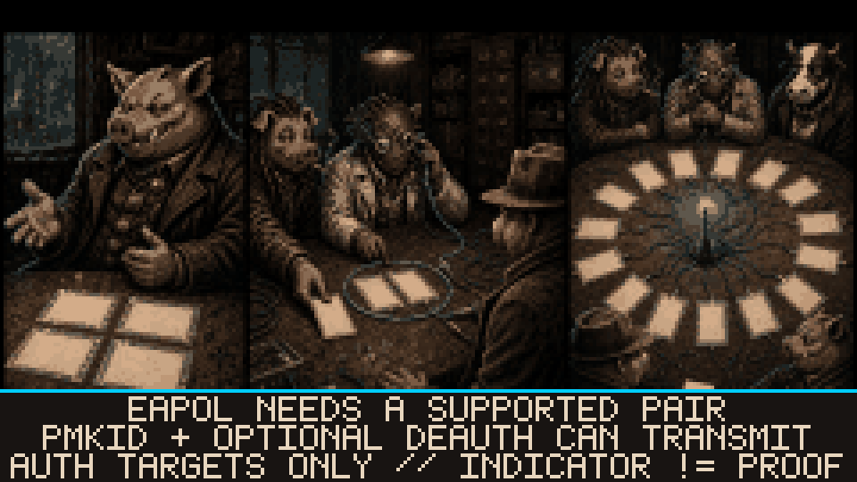

# --[ 2 - CAPTURE AND DEFENSE: RECEIPTS BEFORE VERDICTS

HAMLET PANCETTA handles two related jobs: authorized Wi-Fi authentication collection and defensive awareness of the surrounding Wi-Fi/BLE environment. They can share observations. They cannot share permission. The radio has one custody model and zero legal department.

## Authorized Wi-Fi collection

The capture engine works channels 1 through 13 and tracks up to 64 networks. It can collect:

- PMKIDs returned during an association workflow;
- 802.1X EAPOL message pairs from WPA handshakes;
- the beacon and full 802.11 frame material needed for PCAP export;
- clients, channel statistics, probe-request observations, and capture freshness.

An EAPOL record becomes usable only when it contains a supported message pair. The engine records whether M2 supplied a reliable SNonce instead of promoting every four-way fragment to “handshake” and hoping Hashcat feels generous.

A capture is input for offline analysis. It is not a recovered password, a cracked credential, or a confession from the access point. Frames collected. Claim bounded. Everyone goes home.

The live evidence locker holds at most 256 captures. At runtime it claims between 512 KiB and 2 MiB of PSRAM while leaving room for the rest of the firmware. Unlimited evidence met finite memory. Finite memory won immediately.

## Channel policy that keeps its notebook

Discounted UCB1 ranks all 13 channels using recent capture yield per dwell. Productive air gets more time. Unexplored channels still receive visits. Old success loses weight. One reward ledger survives changes in motion policy because forgetting the band every time the operator starts walking was not adaptive. It was cardio with amnesia.

When motion data exists, four policies adjust dwell and active behavior:

- **CAMP** favors longer observation and focused collection while stationary;
- **PATROL** balances discovery and collection while moving;
- **SPRINT** favors wide discovery during faster movement;
- **LURK** holds near a high-value target instead of wandering the band.

The names carry attitude. The transitions carry evidence: motion state, target value, and channel yield. Shoes optional. Measurements required.

## Transmission boundary

PMKID probing sends open-system authentication and association traffic. Client-assisted handshake collection can send deauthentication frames. Active work may be reduced or skipped for PMF/WPA3-protected networks and dense client populations. Those are implementation decisions, not authorization gates.

Operate only on networks you own or have explicit written permission to test. A menu item can dispatch a frame. It cannot manufacture consent.

The exact Hunt switches, RSSI threshold, and transmit behavior are listed under [`4TT4CK!`](Operator-Configuration.md#4tt4ck).

## Defensive awareness pipeline

Background Recon observes Wi-Fi and BLE when radio custody permits. Hunt and Wardrive can feed it observations without launching a second scan and making two subsystems fight over one antenna. The pipeline stages acquisition, fusion, event admission, forensic side effects, and a generation-stamped immutable snapshot for readers. One custody chain. Fewer ghosts.

The published evidence can carry indicators including:

- deauthentication/disassociation bursts and recent timelines;
- evil-twin, authentication/PMF mismatch, and channel/OUI inconsistency;
- KARMA-style probe-response behavior;
- beacon fingerprint, sequence, RSSI, and entropy anomalies;
- BLE tracker, following, watchlist, spam, and relay-suspect state;
- cross-band correlations between Wi-Fi and BLE observations;
- recent probe intelligence and known-network context.

DEFHOG4 presents SITREP, SIGINT, BLE, FUSION, and LOG views from that immutable snapshot. It starts no scan and transmits no frame of its own. Recon acquires. The pipeline publishes. DEFHOG4 reads. Three verbs. No séance.

Background scan switches, HOGWASH, canary, and forensic logging are listed under [`D3F3NS3`](Operator-Configuration.md#d3f3ns3), including the values that disappear at reboot.

## What a defensive indicator means

These are screening and correlation signals, not proof of identity or intent. RSSI moves when bodies, walls, antennas, transmit power, multipath, and weather enter the calculation. MAC addresses rotate or lie. Similar SSIDs and OUIs can be legitimate. Cross-band correlation can raise confidence. It cannot turn confidence into certainty because the bar filled up.

Use an indicator to choose the next evidence to collect. The firmware can name an inconsistency. It cannot identify the human behind it.

## Persistence of capture evidence

PSRAM holds the primary working copy. With a mounted writable SD card, new captures also receive PCAP/HC22000 sidecars and append to `/hamlet/captures/stash.bin`; the journal can restore them after reboot. Controlled deep sleep and power-off attempt a complete seal first.

A missing card, failed write, abrupt reset, or four-second hard-off can leave the newest evidence only in volatile memory. PSRAM is fast. PSRAM is spacious. PSRAM sees power disappear and immediately forgets your entire relationship. Export accordingly.

---

Captures need an address. Continue with [Field Records and Exports](Field-Records-and-Exports.md).
