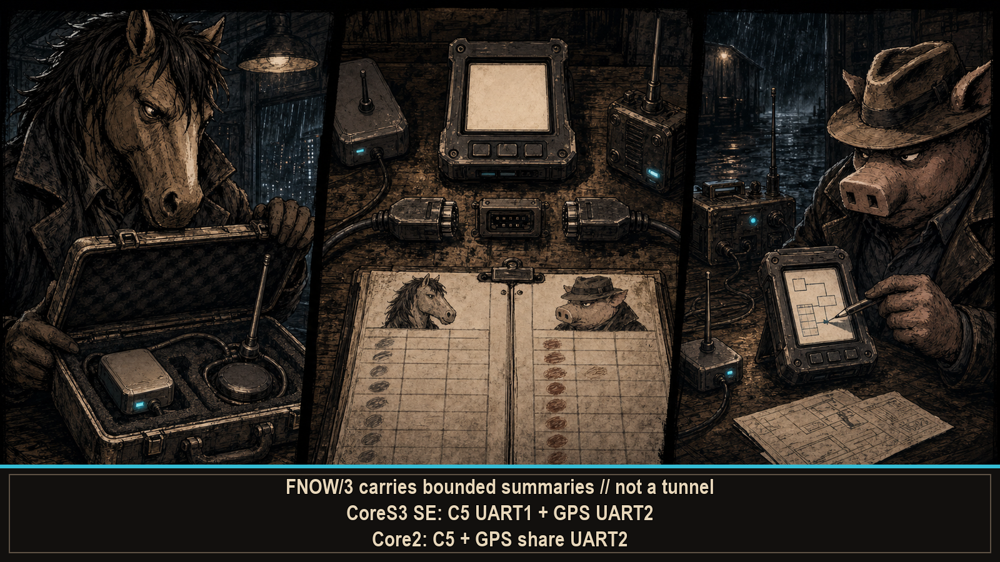

# --[ 4 - COORDINATION AND EXTERNAL HARDWARE

The handheld owns one onboard 2.4 GHz Wi-Fi/BLE radio. FLOCKNOW coordinates compatible peers on that radio. C5, GPS, and Meshtastic attachments report over UART. Different paths. Different owners. One UI trying very hard not to imply it grew new silicon overnight.

## FLOCKNOW / FNOW/3

Normative reference: [RFC-F0690-v3 — NOWFLOCK Peer Coordination Protocol](../rfc/NOWFLOCK_STANDARD.md). The specification text is openly published under CC BY 4.0, so anyone may implement, adapt, or redistribute FNOW/3—including in commercial projects. Copied or adapted RFC text keeps attribution and identifies changes; compatible implementations owe no protocol fee. The RFC is open. The radios still require an authorized operator.

FLOCKNOW is a bounded ESP-NOW coordination protocol. Peers advertise status, elect a coordinator, assign control/channel policy, exchange sightings, request summaries, synchronize time references, and occupy up to 20 peer slots. Every frame fits inside ESP-NOW's 250-byte limit. The packet budget is not a suggestion. The radio has reviewed the pull request.

The Wi-Fi callback uses fixed-capacity staging. It does not allocate memory, write storage, render UI, or begin a second career as the main loop. Callback context receives bytes and fills a bounded mailbox. Deferred code gets the expensive thoughts.

Candidate summaries can carry coarse candidate identity, coordinate tiles, evidence bits, confidence, age, event counts, claimed channels, battery, and authorization-limit flags. They omit raw Wi-Fi MACs, raw BLE addresses, credentials, and handshake payloads.

FNOW/3 exchanges bounded status. It is not encryption. It is not a capture tunnel. It is not a credential transport that became safe because the frame is small.

### Optional PIGBROTHER export

PIGBROTHER snapshot export is a separate opt-in profile. When armed, wardrive rows carry 50 m-grid E7 coordinates, channel, RSSI, authentication token, timestamp, and hashed SSID/BSSID values for peer ingestion and SD replay. The first-party Wardrive CSV retains its own configured precision; FNOW does not put that route precision on the peer wire.

Hashed identifiers are pseudonymous, not anonymous. Snapshot coordinates retain E7 integer encoding but are rounded to the FNOW 50 m grid; grid resolution is not a promise of GPS accuracy. Enable the profile only when every participant and handling path is authorized. Hashing and coarsening changed the representation. They did not erase the sensitivity.

Group tags, report cadence, PIGBROTHER profiles, and the optional BLE transmitter are documented under [`N0W F0CK`](Operator-Configuration.md#n0w-f0ck).

## ESP32-C5 / JanOS bridge

A compatible ESP32-C5 supplies the 5 GHz radio the main unit does not have. The non-blocking UART bridge can ingest:

- completed 5 GHz network scans;
- per-channel AP census data;
- packet-rate samples from the selected channel;
- supported target-observation telemetry;
- checksum-valid GPS RMC fixes;
- JanOS command output and status.

The command desk can also send supported JanOS operations, including active ones. Availability depends on the attached C5, its firmware, its current operation, and the selected target. Emergency stop ends a running C5 operation. It cannot recall frames already transmitted. UART is quick. Time is quicker.

CoreS3 SE gives C5 a dedicated UART1 route while GPS may remain on UART2. Core2 shares UART2 between local GPS and C5. Two devices can request the wire. UART2 remains stubbornly singular.

## External NMEA GPS

The GPS manager feeds UART NMEA through TinyGPS++ and keeps four states separate:

1. bytes arrived;
2. checksum-valid NMEA sentences arrived;
3. a valid location exists;
4. the fix is fresh enough to use.

When provided, it reports satellites, latitude, longitude, altitude, speed, course over ground, HDOP, age, UTC epoch, and accumulated distance. Course over ground is not handset heading. Bytes are not sentences. Sentences are not fixes. A fix does not stay fresh forever. Four checks exist because one green icon previously tried to do all their jobs.

## Meshtastic Unit C6L

M3SH T4LK uses an external Meshtastic Unit C6L for LoRa modulation, routing, retries, channel crypto, and radio ownership. The handheld supplies display, composer, scrollback, and the UART bridge. The C6L supplies the LoRa radio. Delegation works best when the peripheral is physically attached.

Two codecs are supported:

- **TEXTMSG** provides primary-channel broadcast lines with sender and body;
- **PROTO** adds the node roster, signal-to-noise ratio, battery, hop evidence, direct messages, acknowledgements, and protocol session state.

The handheld retains up to 64 messages for the session and paces outgoing UART traffic. Under TEXTMSG, direct messages are refused instead of quietly becoming broadcasts. If the codec cannot report hops, the UI shows no hop evidence. Unknown remains unknown. Zero has enough existing responsibilities.

This is external LoRa capability. Neither CoreS3 SE nor Core2 hides a LoRa radio under the display. Enabling the bridge is configuration, not conjuring.

Board-specific C5 and C6L routes, baud rates, and codec matching are documented under [`4CC3SS0R13S`](Operator-Configuration.md#4cc3ss0r13s).

---

Interrogate the boards in [Hardware and Power](Hardware-and-Power.md). Interrogate the claims in [Evidence Truth and Safety](Evidence-Truth-and-Safety.md).
