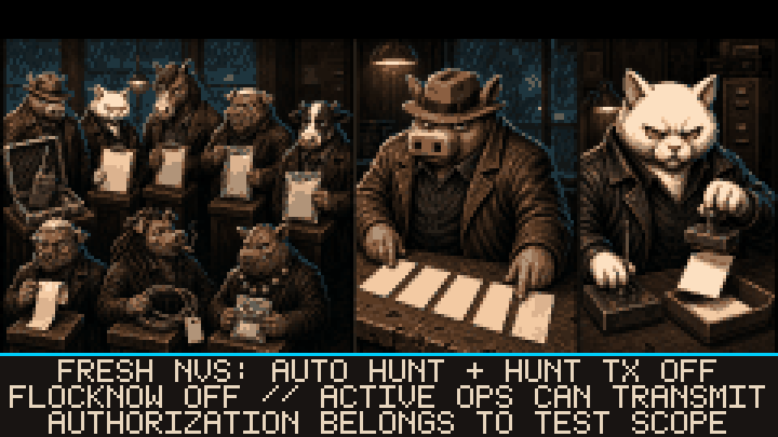

# --[ 7 - EVIDENCE TRUTH AND SAFETY: THE AUTHORIZATION LINE

HAMLET PANCETTA is a security-research instrument. Some functions listen. Others transmit, create access points, write identifiers and coordinates, delete files, or send data to external services. Treat each mode according to what it actually does. This is the page where the jokes lower their voice and the verbs get audited.

A blank NVS starts with automatic Hunt, Hunt transmitters, and FLOCKNOW disarmed. That is a startup posture, not a sandbox: the CoreS3 SE C5 bridge retains its target-specific default, and explicit active scans, FTM, Wardrive, access points, uploads, and operator-enabled controls can still transmit. Upgrades retain stored choices, because erasing intent is not the same as making it safe.

## Capability ledger

| Capability | Observes | Transmits | Persists or exports |
|---|---:|---:|---:|
| 2.4 GHz Wi-Fi scope | Yes | Only for explicit client poke or FTM actions | Session state; selected evidence may reach SD |
| Deauthentication watch | Yes | No for detection alone | Recent forensic history in memory |
| BLE passive scan | Yes | No | Session catalog; watchlist configuration in NVS |
| BLE active scan / GATT / sound / chaff | Yes | Yes | GATT result and local state |
| Authorized Wi-Fi capture | Yes | PMKID association and optional deauthentication workflows | PSRAM primary; SD journal/PCAP/HC22000 when available |
| Wardrive | Yes | Wi-Fi scan requests | Coordinate-backed WiGLE CSV on SD |
| DEFHOG4 | Reads published evidence | No additional radio work | Review state in memory |
| FLOCKNOW | Receives peer summaries | ESP-NOW summaries and requests | Peer/session state; optional snapshot replay on SD |
| XF3RM0D3 | Reads SD and browser requests | Local WPA2 AP + HTTP/DNS | Browser upload/download/delete changes SD |
| WPA-SEC / WiGLE services | Reads local exports | HTTPS client traffic | Server receipts, markers, potfiles, cached stats |
| C5 bridge | Receives external observations | Can send JanOS commands | External output/session state; selected rows may reach SD |
| Meshtastic bridge | Receives C6L messages/roster | Sends UART text/PROTO requests to C6L | 64-message session scrollback |

## What counts as measurement

- A received frame, completed scan row, valid NMEA fix, FTM result, or acknowledged mesh packet is evidence with a source and age.
- A MODEL lobe, proximity class, bearing estimate, classifier, anomaly score, or cross-band correlation is interpretation derived from that evidence.
- A stale sample remains stale. Retaining it preserves continuity. It does not give the timestamp a second childhood.
- External C5, GPS, and Meshtastic data remains labeled as external.

The firmware can make a disciplined inference. It cannot promote one to measurement because the confidence bar reached the expensive end of the palette.

## Known limits

**RSSI is noisy evidence.** Bodies, walls, multipath, antenna orientation, transmit power, and motion can change it. Proximity and bearing views guide the next observation; they do not guarantee distance or position. Radio waves continue refusing straight-line management.

**Wi-Fi scope is not a calibrated spectrum analyzer.** It visualizes Wi-Fi observations and reconstructed context. It does not measure arbitrary RF energy across the band. Sinc lobes are geometry. The display drawing them beautifully did not issue a calibration certificate.

**FTM range is not bearing.** It requires an advertised responder, sends an active request, and reports range/variance only when the exchange succeeds. One scalar result arrived. A compass did not.

**Threat labels are indicators.** Evil-twin, KARMA, tracker-following, relay, hostile-client, and tool signatures can be false-positive or incomplete. Confirm with independent evidence before the label becomes an accusation. Classifiers make suggestions. Lawyers prefer exhibits.

**GPS needs a real fix.** Bytes are not NMEA. NMEA is not a location. A location is not fresh forever. Four states entered. One usable coordinate left.

**Hashes do not erase sensitivity.** Hashed SSIDs/BSSIDs and candidate IDs can still be linkable. Full E7 coordinates in optional snapshot exports remain location data; storage resolution is not measurement accuracy. The representation changed. The privacy problem kept its address.

**Storage can fail.** PSRAM is volatile. SD journals and sidecars improve durability only when the card is mounted and writes succeed. Hard power-off can bypass sealing. No successful write, no durable evidence. This rule has survived every attempt to out-negotiate electricity.

## Operator obligations

- Test only systems and radio environments you own or have explicit permission to assess.
- Check local interception, radio, privacy, tracking, data-protection, and deauthentication rules.
- Obtain consent before following BLE identities or collecting location-linked observations.
- Protect Wi-Fi credentials, API tokens, captures, potfiles, MAC addresses, peer identifiers, and coordinates.
- Redact sensitive identifiers before sharing logs or issue reports.
- Verify the selected hardware image before flashing; Core2 and CoreS3 SE are different targets, not aliases wearing the same 320×240 display.
- Back up SD data before firmware changes or destructive file operations.

Settings are operational controls, not legal approval. The [configuration ledger](Operator-Configuration.md) records which controls transmit, persist, or require attached hardware. The firmware can log a frame. The operator must carry the authorization.

## Deliberate boundary

This wiki ends at capability, evidence, hardware, and safety. Rooms, rewards, and the rest of the firmware remain available for direct discovery. Documentation covers the instrument. Pancetta keeps the personality update out of the evidence ledger.

Capability documented. Permission still required.

---

Return to the [capability files](Home.md). Bring the receipts.

`==[ EOF ]==`
