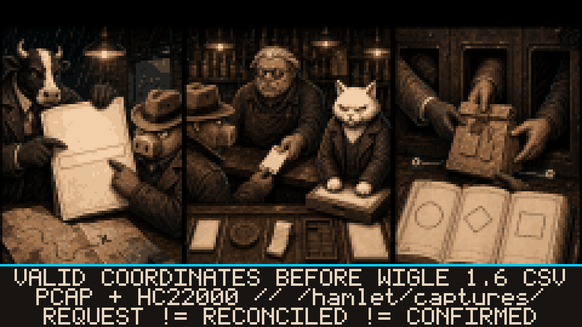

# --[ 3 - FIELD RECORDS AND EXPORTS: GIVE EVIDENCE AN ADDRESS

An observation becomes a useful field record when it has a source, a time, a location, and a file that survives the trip home. Until then it is session state with ambitions. HAMLET PANCETTA writes locally and exports only through explicit paths.

## Wardrive logging

Wardrive runs asynchronous Wi-Fi scans, deduplicates BSSIDs in PSRAM, and writes WiGLE 1.6 CSV under `/hamlet/wardrive/`. It can interleave BLE collection and accept separately labeled 5 GHz scan rows from an attached C5 bridge. One route. Multiple sources. Labels stay attached because evidence swapping identities is how spreadsheets become folklore.

Swipe left or right in Wardrive to exchange the animated WARTHOG cockpit for the fullscreen sensor tape. The tape forces the configured dim backlight level and a 10 Hz frame budget while the same Wi-Fi, BLE, GPS, C5, and Core-SD session continues underneath. It reports the active coordinate source, fix/feed state, coordinates, satellite/HDOP/fix age where the Core receiver can supply them, recent scan composition, strongest observed AP, 5 GHz C5 snapshot, BLE count, SD state, distance, and elapsed time. When fresh C5 coordinates own the position, Core-only distance, speed, and course stay labeled as Core evidence instead of borrowing the C5 badge. Swiping back resumes the cockpit without restarting the session. A navigation-lock earcon confirms a real Core or fresh C5 position; warning pairs repeat only after a previously held fix is lost. The sound reports GPS state. It does not turn coordinates into target-bearing evidence.

A WiGLE row is written only when a valid coordinate source exists. Coordinates can come from:

- a checksum-valid, fresh NMEA fix on the configured GPS UART; or
- a fresh GPS fix parsed from the attached C5 bridge.

Without a fix, scanning continues and counters can move. Location-backed CSV rows wait. `0.000000` is a number. It is not a place, and the export code has stopped pretending otherwise.

The field view can report scan cycles, unique Wi-Fi/BLE observations, distance, speed, satellites, coordinate source and age, SD state, and C5 link state. Distance comes from accumulated GPS positions. The pedometer was offered the job. The evidence requirements declined.

Receiver routing and BLE interleave are documented under [`GPS N4V`](Operator-Configuration.md#gps-n4v).

## Local evidence files

A mounted writable SD card is the durable evidence room. Current addresses are:

- `/hamlet/captures/stash.bin` for the recoverable capture journal;
- `/hamlet/captures/` for PCAP and HC22000 sidecars;
- `/hamlet/wardrive/` for WiGLE CSV sessions;
- `/hamlet/export/` for downloaded or assembled export material;
- `/hamlet/stats/` for session records.

The firmware bounds filenames, normalizes paths, stages sensitive writes, and keeps server-success markers separate from local files. Good procedure. Still just procedure. A missing, read-only, failing, or counterfeit SD card can refuse the operation, and the actual write result gets the final word.

## Capture formats

The export layer can create:

- IEEE 802.11 PCAP containing a retained beacon plus captured EAPOL frames;
- Hashcat 22000 PMKID lines;
- Hashcat 22000 EAPOL lines;
- bounded batch HC22000 output for unsynced records.

Conversion preserves the evidence available. It does not invent a nonce, restore an absent frame, or make an incomplete handshake complete by choosing a more confident filename.

## Browser file transfer

XF3RM0D3 creates a local `PANCETTA_XFER` WPA2 access point with a per-session password and serves a file manager at `192.168.4.1`. It can browse, upload, download, and delete SD files without upstream internet access. Potfiles and WiGLE CSV can be viewed in the browser.

Delete means delete. Port 80 did not ship with a recycle bin.

## Optional network services

With operator-supplied credentials and an upstream Wi-Fi connection, the firmware can:

- upload capture PCAP data to WPA-SEC and download the resulting potfile to SD;
- upload WiGLE CSV sessions, retain durable transaction IDs, reconcile pending submissions, and cache user statistics.

Credentials live in local NVS. Results distinguish missing credentials, transport failure, authentication failure, throttling, rejection, and ambiguous or pending server state. “Request sent” is not “server accepted.” The network stack has attempted this shortcut before. The receipt system remains unconvinced.

Treat API tokens, potfiles, captures, coordinates, and SD contents as sensitive. TLS checks the transport. It does not select a trustworthy recipient or redact your files.

Credential field limits and masking behavior are documented under [`UPL1NKS`](Operator-Configuration.md#upl1nks).

---

The files have addresses. Now meet the outside witnesses in [Coordination and External Hardware](Coordination-and-External-Hardware.md).
