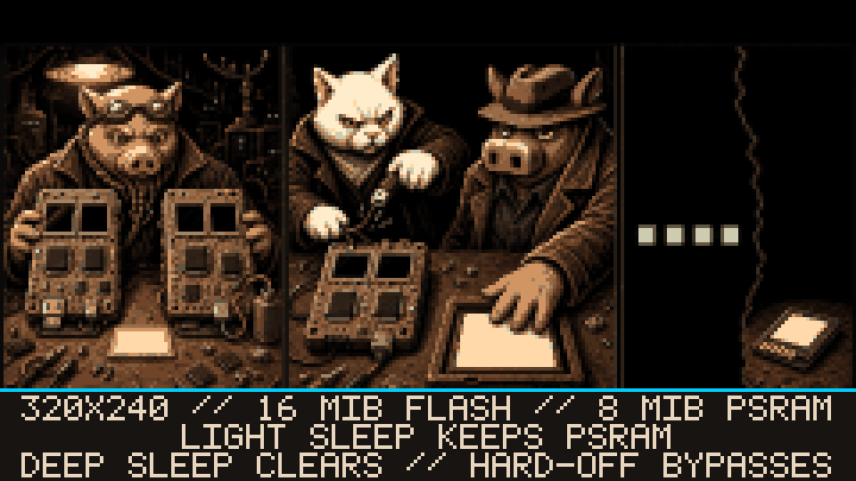

# --[ 5 - HARDWARE AND POWER: TWO BOARDS ENTER THE LINEUP

HAMLET PANCETTA builds for two 320×240 touch devices with 16 MiB flash and 8 MiB PSRAM. CoreS3 SE is the primary production target. Core2 v1.1 is compatibility coverage. Same source tree. Different silicon. The preprocessor knows. The documentation should too.

## Target comparison

| Capability | M5Stack CoreS3 SE | M5Stack Core2 v1.1 |
|---|---|---|
| SoC | ESP32-S3, dual-core LX7 at up to 240 MHz | ESP32-D0WDQ6-V3, dual-core LX6 at up to 240 MHz |
| Onboard radio | 2.4 GHz Wi-Fi + BLE | 2.4 GHz Wi-Fi + BLE |
| Display/input | 320×240 touch; shared A/B/C control model | 320×240 touch; shared A/B/C control model |
| Flash / PSRAM | 16 MiB / 8 MiB | 16 MiB / 8 MiB |
| Internal battery | No | Yes |
| Onboard IMU | No | MPU6886 |
| Vibration motor | No | Yes |
| Optional base | M5GO Battery Bottom2 can supply battery and MPU6886 motion data | Not required for those built-in functions |
| C5 UART | UART1 on GPIO 44/43; GPS may remain on UART2 | UART2 on GPIO 33/32, shared with the local GPS route |
| Explicit Wi-Fi FTM range action | Supported when the target AP advertises responder capability | Not exposed as the CoreS3 SE FTM path |

One CoreS3 SE image works with or without the compatible base. Motion, haptic, and battery-dependent features inspect runtime hardware state. When the hardware is absent, the capability is absent. Firmware cannot `#define` an accelerometer into the room.

The [operator configuration](Operator-Configuration.md) marks every setting that depends on an IMU, battery, Bottom2, microphone, or target-specific UART route. The table is long because GPIO assignments are facts and “probably connected” is not a pin number.

## Radio custody

Wi-Fi scanning, promiscuous capture, ESP-NOW, local access points, upstream clients, and BLE share one onboard radio subsystem. Foreground modes take explicit custody. Background Recon pauses, changes cadence, or consumes another mode's observations instead of launching a competing scan and asking FreeRTOS to settle a domestic dispute.

Optional C5 and Meshtastic radios remain separate UART-owned devices. GPS is a feed, not a radio owner, but on Core2 it can still conflict with C5 for UART2. One wire. One active owner. Several menu settings learning boundaries.

## Adaptive power policy

Mode-aware profiles select CPU speed, Wi-Fi transmit power, frame rate, display dimming, and modem power saving. The current range is:

- CPU at 80, 160, or 240 MHz;
- Wi-Fi transmit power from 2 dBm to 20 dBm;
- target frame rates from 10 to 60 FPS;
- low-battery and critical-battery adaptations when enabled.

The firmware can enter light sleep, deep sleep, or PMIC power-off. Light sleep retains PSRAM. Deep sleep and power-off clear live PSRAM and first attempt to seal evidence to a mounted writable SD card. A four-second hardware power-off bypasses that courtesy.

Power policy reduces consumption. It does not create a battery inside CoreS3 SE, recover volatile captures after hard-off, or negotiate extra charge from an empty cell. Software optimized. Physics kept root access.

## Feedback and motion

When the hardware reports for duty, the firmware can use:

- MPU6886 acceleration/gyro data for steps, pose, tilt, and motion-aware RF policy;
- vibration for haptic confirmation and bearing locks;
- speaker output for alerts, Geiger cadence, sound effects, and generated noir jazz;
- ambient LEDs for status and alert cues.

These are feedback and sensor capabilities, not evidence by themselves. A haptic tick reports that software crossed a condition. It does not improve the underlying estimate by vibrating harder.

## Production image receipt

The repository's `firmware/` directory contains one merged CoreS3 SE production image. It includes the board-correct bootloader, partition table, boot application, and firmware for a full write at address `0x0`. One file. Complete flash layout. No scavenger hunt across four offsets.

- firmware version: `0.1.0-cores3se`
- source commit embedded in the image: `9000415`
- artifact: [`hamlet-pancetta-v0.1.0-cores3se.bin`](../firmware/hamlet-pancetta-v0.1.0-cores3se.bin) (2,951,664 bytes)
- SHA-256: `6ea3a494a19ca8675211765ad1d8e3b3be4d7d7c7044b396e3d88a3f4736b80b`

The embedded commit identifies the source tree that produced the firmware.
The repository commit carrying the resulting binary is necessarily its child:
putting that future hash inside the image would change the image, the tree, and
the hash again. The two hashes have different jobs. One names the code under
test; the other files the evidence after the test.

The image was structurally verified after merge. That receipt proves the artifact. It does not prove a flash, boot, visible screen, RF observation, or attached peripheral. The binary passed inspection. Your hardware has not yet been called as a witness.

---

Before any transmitter takes custody of the antenna, read [Evidence Truth and Safety](Evidence-Truth-and-Safety.md).
