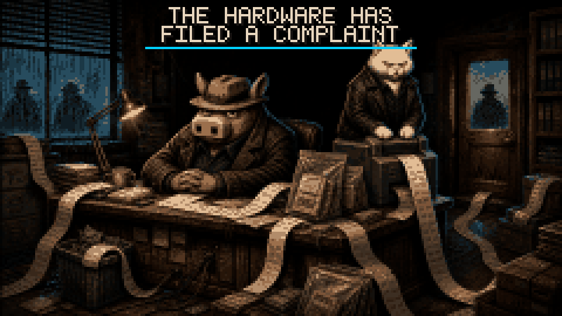
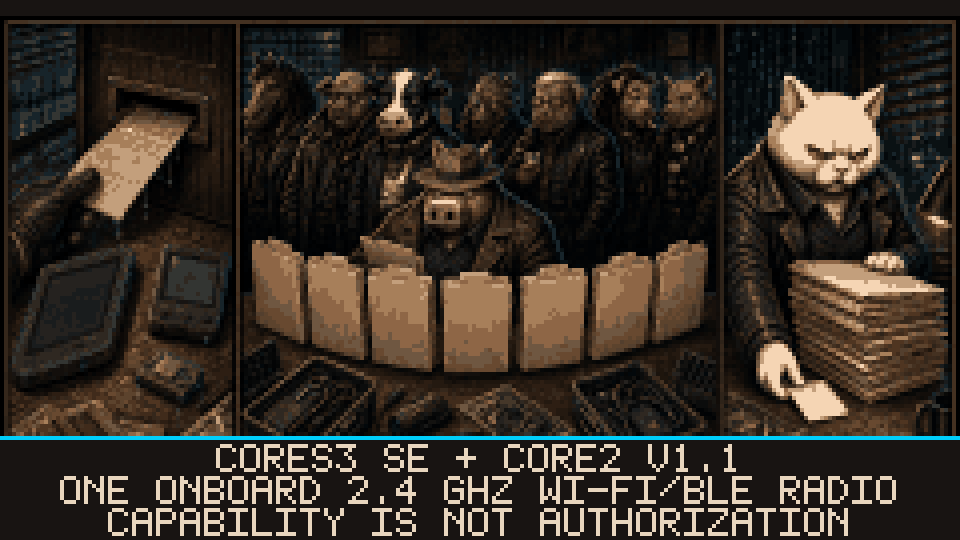

# --[ 0 - HAMLET PANCETTA: THE CAPABILITY FILES

> Pancetta brought one radio, several ledgers, and no patience for evidence that changes its story after reboot.

HAMLET PANCETTA is portable Wi-Fi and Bluetooth Low Energy (BLE) security-research firmware for M5Stack CoreS3 SE and Core2 v1.1. It observes radio activity. It collects authorized Wi-Fi evidence. It writes field records, correlates defensive indicators, and works with optional external radios. Small device. Large opinions about provenance.

This wiki documents what the firmware does, what it transmits, what survives power loss, and exactly where the evidence stops. It does not explain every room, reward, or surprise. The instrument gets a manual. Pancetta keeps a few drawers locked because documentation should leave the firmware something to do.

## The desk at a glance

| Capability | What it actually does | Where the story stops |
|---|---|---|
| [Radio observation](Radio-Observation.md) | Builds 2.4 GHz Wi-Fi sweep history, network/client context, BLE catalogs, and deauthentication alerts | Onboard 2.4 GHz Wi-Fi/BLE; an optional C5 supplies separately labeled 5 GHz evidence |
| [Capture and defense](Capture-and-Defense.md) | Collects PMKIDs and EAPOL pairs during authorized tests; correlates Wi-Fi, BLE, and capture indicators | Some collection actions transmit; DEFHOG4 only reads the evidence already published |
| [Field records and exports](Field-Records-and-Exports.md) | Writes coordinate-backed WiGLE CSV, PCAP, HC22000, journals, and browser-accessible SD files | Durable records need a mounted, writable SD card. PSRAM remembers right up to the moment it absolutely does not |
| [Coordination and external hardware](Coordination-and-External-Hardware.md) | Exchanges bounded FNOW/3 summaries and talks to optional C5, GPS, and Meshtastic hardware | External radios keep their names. A confident UI still cannot manufacture a 5 GHz antenna |
| [Hardware and power](Hardware-and-Power.md) | Runs one source tree across the primary CoreS3 SE and compatibility Core2 target | Battery, IMU, vibration, UART routing, and FTM support differ by target |
| [Operator configuration](Operator-Configuration.md) | Expands every `TUN3 P1G` label into values, effect, persistence, and hardware boundary | Some switches transmit, store secrets, or wake up after reboot pretending the session never happened |
| [Evidence truth and safety](Evidence-Truth-and-Safety.md) | Names what is measured, inferred, transmitted, persisted, or unavailable | Capability is not permission. Correlation is not attribution. A polished pixel remains a pixel |

## Built in, attached, or borrowed

The onboard ESP32 radio handles 2.4 GHz Wi-Fi and BLE. Full stop. It does not scan 5 GHz, receive GPS, or speak LoRa. Those jobs require hardware with the decency to exist:

- an ESP32-C5 running compatible JanOS firmware for 5 GHz scan and observer data;
- an NMEA GPS source, or a fresh GPS fix carried by the C5 bridge;
- a Meshtastic Unit C6L for LoRa text and node information;
- an M5GO Battery Bottom2 on CoreS3 SE when battery power and MPU6886 motion data are wanted.

Every external observation keeps its source label. Adding a second radio adds a second witness. It does not retroactively upgrade the first one.

## Current production image

The primary release artifact is one merged CoreS3 SE image built with the release revision recorded on the [hardware page](Hardware-and-Power.md). The repository keeps it under `firmware/`. One binary. Board-correct parts. Hash included. Mystery firmware was not invited.

The receipt proves the image was produced and structurally verified. It does **not** prove that your device was flashed, booted, found GPS, wrote SD, or observed a single RF frame. Build success is not hardware testimony. We checked. The compiler has never seen your screen.

## Authorization is the first control

HAMLET PANCETTA can transmit association requests, active BLE requests, deauthentication frames, local access points, ESP-NOW traffic, and commands to attached radios. Use those functions only on equipment you own or are explicitly authorized to test. The [configuration ledger](Operator-Configuration.md) identifies each operator-facing transmitter and session-only control. Protect captures, identifiers, coordinates, API credentials, and SD-card exports as sensitive data.

Consent is not a runtime default. No callback can grant it later.

---

Open [Radio Observation](Radio-Observation.md). Read [Evidence Truth and Safety](Evidence-Truth-and-Safety.md) before the first transmitter gets ideas.
