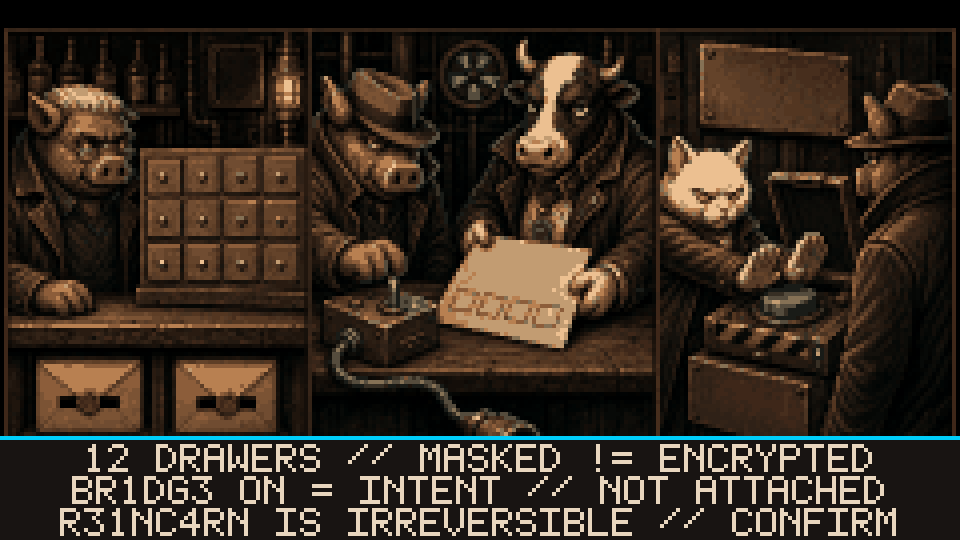

# --[ 6 - OPERATOR CONFIGURATION: EVERY SWITCH HAS CONSEQUENCES

`TUN3 P1G` contains 12 one-level drawers, short labels, and immediate consequences. This page expands every switch into values, side effects, persistence, transmit behavior, and hardware dependencies. The screen had room for eight characters. The wiki has no such excuse.

## Controls and persistence

- Use **A/C** or swipe up/down to move, **B** to open a drawer or change the selected value, and **C+** to close the drawer or leave Settings. Outside modal editors and warnings, hold the top status strip to lock touch globally; swipe up to unlock it.
- Text fields open the touch keyboard. Passwords and API tokens are masked in the list, but they remain sensitive values stored locally in NVS. Asterisks hide pixels. They do not encrypt bytes.
- Most changes apply immediately and save to NVS after a short debounce; leaving Settings flushes pending changes.
- Date and time fields write the hardware RTC instead of NVS.
- `C4N4RY` and `F0R3NS1C` are session controls. They return to their boot state after a restart.
- Destructive or transmitting controls can present an additional warning. A warning records intent. A saved value still does not grant authorization.
- Fresh installs leave automatic Hunt, Hunt transmitters, and FNOW/3 off. Upgrades retain explicit stored choices; inspect them before field use.

CoreS3 SE is the primary target. Rows marked **IMU**, **Bottom2**, **battery**, **microphone**, or **CoreS3 SE only** need that hardware. Missing peripheral means missing capability. The settings menu cannot upsell imaginary telemetry.

## `PR0F1L3`

| Screen label | Values | Description |
|---|---|---|
| `P1G 1D` | Four characters | Sets the local FNOW/3 handle. Input is normalized to four uppercase letters or digits; missing or unsupported characters become `X`. |
| `H34D F1T` | Unlocked styles | Selects Pancetta's cosmetic head treatment. Additional styles become available through progression; this does not change radio behavior. |

`P1G 1D` changes identity. `H34D F1T` changes the hat. Neither changes RF evidence. Pancetta has tested this extensively in mirrors.

## `L00K & F33L`

| Screen label | Values | Description |
|---|---|---|
| `SK1N HU` | Generated hue names | Rotates the base display hue in 137-degree steps. The shown theme name is derived from the resulting hue. |
| `SK1N ST` | `D4RK`, `1NV3RT`, `R3TR0`, `M0N0`, `N0STR0M0`, `THE OG` | Selects the base contrast and palette treatment. |
| `GL0W TYP` | `TH3M3`, `N30N`, `SPL1T`, `W4RM`, `C00L`, `CL4SH` | Chooses the accent-light hue family used by illuminated scene elements. |
| `GL0W LV` | `0FF`, `L0`, `M3D`, `H1` | Sets the emissive-light boost without changing the base theme. |
| `BRIGHT` | 10-100%, in 10% steps | Sets display backlight brightness and applies it immediately. |
| `SFX VOL` | 0-10 | Sets sound-effect volume. Zero also disables sound effects. |
| `MUS1C` | 0-10 | Sets generated noir-jazz volume. Zero is silent. |
| `HAPTIC` | 0-10 | Sets vibration strength and plays a test tick. Zero disables haptics; a motor is required. |

`THE OG` is the fresh-install style. An existing saved style still wins after an upgrade; the firmware does not redecorate an occupied device while pretending it found the keys under the mat.

Theme, glow, volume, and haptics change presentation. They do not improve RSSI, upgrade a classifier, or install a battery through atmosphere. The LEDs remain decorative. Very committed, still decorative.

## `SCR33N & 1NPUT`

| Screen label | Values | Description |
|---|---|---|
| `DIM AFTER` | `NEVER`, 10-300 s | Sets the inactivity delay before the display dims. `NEVER` disables automatic dimming. |
| `DIM LEVEL` | `OFF`, 5-50% | Sets dimmed backlight output, capped by the current normal brightness. `OFF` uses a zero-brightness dim state. |
| `ROTATE` | `0`, `180` | Rotates the display and touch coordinate system by 180 degrees. |
| `LED GL0W` | `ON`, `OFF` | Enables ambient LEDs on a compatible M5GO Battery Bottom2. Turning it off blanks the LEDs immediately. |
| `LED C0L0R` | `4UT0`, `TH3M3`, 12 fixed hues | `4UT0` samples screen-edge colors, `TH3M3` follows the active theme, and the remaining choices select a fixed hue. **Bottom2.** |
| `LED LV` | 1-10 | Sets ambient LED brightness. **Bottom2.** |
| `TILT NAV` | `ON`, `OFF` | Enables left, right, and up tilt gestures. **IMU.** |
| `SPEC TILT` | `ON`, `OFF` | Lets upright tilt act as the Spectrum channel dial. **IMU.** |
| `PARALLAX` | `ON`, `OFF` | Enables depth motion in Pancetta's rooms when an IMU is detected. `OFF`, or an absent IMU, holds room layers at their neutral positions and avoids parallax-triggered room-base cache rebuilds. The setting does not power down the shared IMU used by steps, gestures, and RF bearing. **IMU.** |
| `B4TH M1C` | `ON`, `OFF` | Lets the bath scene react to microphone energy. The microphone temporarily owns the shared audio bus, so speaker output pauses while it listens. **CoreS3 SE only.** |

Input features follow installed sensors. The display can rotate itself. It cannot rotate absent hardware into existence. We gave it both angles.

## `P0W3R & T1M3`

### Power

| Screen label | Values | Description |
|---|---|---|
| `SHAKE WAKE` | `ON`, `OFF` | Allows a shake gesture to wake a dimmed display. **IMU.** |
| `ALERT WAKE` | `ON`, `OFF` | Allows Recon alerts to wake a dimmed display. |
| `B4TT 4D4P` | `ON`, `OFF` | Enables automatic low- and critical-battery power limits. The policy is bypassed while external VBUS power is present. **Battery.** |
| `VBUS 60` | `ON`, `OFF` | Forces the 60 FPS profile while external VBUS power is present. |

Power policy works with the energy available. VBUS bypasses battery adaptation. An empty cell contributes no counterproposal.

### Clock

| Screen label | Values | Description |
|---|---|---|
| `YEAR` | 2020-2099 | Advances the RTC year and clamps the current day when needed. Invalid RTC state is shown as dashes. |
| `MONTH` | 1-12 | Advances the RTC month and clamps the day to that month's valid range. |
| `DAY` | Valid day for the month | Advances the RTC day with leap-year handling. |
| `HOUR` | 00-23 | Advances the RTC hour. |
| `MINUTE` | 00-59 | Advances the RTC minute and resets seconds to zero. |
| `NTP SYNC` | `[EXEC]`, then status | Connects to the saved Wi-Fi network and runs the trusted-clock bootstrap. A live GPS UTC fix can satisfy it first; otherwise the device queries NTP. The accepted result is written to the system clock and hardware RTC. `[OK]` means the clock is trusted; `[FAIL]` retains a safe connection or sync error for the selected-row hint. The temporary STA session is closed after success, failure, cancellation, or leaving Settings. |

The RTC supplies record timestamps and session-streak dates. Manual fields and a successful NTP sync establish a trusted clock for future TLS and time-aware records. Earlier files keep their original timestamps. The firmware changes clocks, not history.

## `TR4CK & W4TCH`

### Tracking

| Screen label | Values | Description |
|---|---|---|
| `AUTO HUNT` | `ON`, `OFF` | Enters Hunt from the idle room after 30 seconds of detected walking. **IMU.** |
| `RSSI SMOOTH` | `FAST`, `MED`, `SLOW` | Chooses the signal filter: faster response preserves more jitter; slower response is steadier but lags changes. The current response windows are approximately 200, 300, and 500 ms. |
| `GHOST MARK` | `ON`, `OFF` | Keeps a last-known marker after a tracked target's live signal becomes stale. The marker is retained evidence, not a current position. |

### Watchlist

| Screen label | Values | Description |
|---|---|---|
| `#1`, `#2`, `#3` | Label or `[EMPTY]` | Renames or removes the first three persistent BLE watchlist slots. Clear a label to remove that slot. Empty slots are populated from `P1G EARS`; the runtime watchlist can hold six identities. |

Filters smooth evidence. Ghost markers retain the last known sample. Neither makes old data live again. The timestamp is still undefeated.

## `GPS N4V`

| Screen label | Values | Description |
|---|---|---|
| `R3C31V3R` | `ON`, `OFF` | Enables the external NMEA receiver. On Core2, C5 and local GPS both use UART2, so only one can own it. |
| `P0W3R` | `ALWAYS`, `SLEEP` | `ALWAYS` keeps the GPS UART active across modes. `SLEEP` opens it only when Wardrive needs the local receiver. |
| `RX P1N` | Board-safe GPIO/DIP pairs | Selects the host RX route from the GPS module's TX line. CoreS3 SE offers G44/D6, G18/D7, G7/D8, or G10/D10; Core2 offers G3/D6, G13/D7, G19/D8, G34/D9, or G35/D10. |
| `TX P1N` | Board-safe GPIO/DIP pairs | Selects the host TX route to the GPS module's RX line. CoreS3 SE offers G17/D2 or G43/D1; Core2 offers G1/D1, G14/D2, G2/D3, G27/D4, or G0/D5. |
| `B4UD` | 9600, 38400, 57600, 115200 | Sets receiver baud and restarts an active GPS UART. The M003-V21/AT6668 default is 115200. |
| `WD BLE` | `ON`, `OFF` | Interleaves BLE observations with Wardrive and includes eligible BLE rows in location-backed WiGLE output. |

Pin labels describe the host GPIO and the GPS module's physical DIP switch. Match both ends. UART silence has many suspects, and crossed wires keep winning the first interview.

## `4TT4CK!`

Every control in this drawer can change active collection behavior. Several transmit raw 802.11 frames. They are off on a fresh install and require an explicit operator choice. Use them only on networks you own or are explicitly authorized to test. No voice setting overrides that boundary.

| Screen label | Values | Description |
|---|---|---|
| `MUDBALL` | `OFF`, `ON`, `AGGR0` | Controls Hunt deauthentication. `ON` uses standard selected-client bursts; `AGGR0` uses bidirectional bursts, higher counts, and shorter intervals. Enabling from `OFF` presents the legal warning. |
| `3P0L INJ` | `ON`, `OFF` | Enables EAPOL Start/Logoff data-frame injection as the Hunt fallback for protected-management-frame targets. It transmits and does not guarantee a handshake. |
| `CSA H3RD` | `ON`, `OFF` | Enables spoofed Channel Switch Announcement beacons after an eligible client action, prompting reassociation attempts. It transmits. |
| `4UTH FLD` | `ON`, `OFF` | Enables randomized-MAC authentication floods when no eligible client is available for the earlier Hunt tiers. It transmits and is a last-resort test. |
| `SAE REJ` | `ON`, `OFF` | Enables the SAE reject/downgrade-assist path for compatible WPA3 transition targets. It transmits; target support and outcome are not assumed. |
| `AUTO PROBE` | `ON`, `OFF` | Allows Hunt to initiate PMKID association probes automatically for eligible networks. It transmits authentication and association traffic. |
| `PROBE dB` | -50 to -80 dBm, in 5 dB steps | Sets the minimum observed RSSI for automatic probing. More-negative values admit weaker targets. |

PMF, WPA3 behavior, client density, and target support can still reduce or prevent an action. A switch enables policy. It does not guarantee an outcome. It does not authorize the attempt. Two separate limits. Both active.

## `D3F3NS3`

| Screen label | Values | Description |
|---|---|---|
| `IPP` | `ON`, `OFF` | Master control for the Interdimensional Pig Pen background-defense acquisition loop. The BLE and Wi-Fi switches below select its radio work. |
| `IPP BLE` | `ON`, `OFF` | Enables passive background BLE tracker sweeps while IPP is active and radio custody permits. |
| `IPP WIFI` | `ON`, `OFF` | Enables asynchronous background Wi-Fi environment scans while IPP is active and radio custody permits. Turning it on requests a scan. |
| `HOGWASH` | `ON`, `OFF` | On a detected deauthentication burst, can hold the observed channel and inject deliberately invalid EAPOL material to contaminate an attacker's capture. This is an active transmitter. |
| `PARANOIA` | `ON`, `OFF` | Allows deauthentication alerts to interrupt any foreground mode instead of remaining local to defensive views. |
| `L00T P1N` | `ON`, `OFF` | Sets or clears a four-character A/B/C button PIN for the loot-taking path. It is a local interaction gate, not storage encryption. |
| `C4N4RY` | Up to 32 characters | Sets the ghost-canary SSID used to detect rebroadcasts. Clearing it regenerates a device-derived value. **Session only; changing it clears the current trip state.** |
| `F0R3NS1C` | `ON`, `OFF` | Enables live defensive JSONL appends to `/recon/live.jsonl` when a writable SD card is available. **Session only.** |

Defense labels are indicators and policy controls. They do not turn correlation into attribution. A loud alert can still be wrong at full volume; see [Evidence Truth and Safety](Evidence-Truth-and-Safety.md).

## `UPL1NKS`

### Network

| Screen label | Values | Description |
|---|---|---|
| `WIFI SSID` | Up to 32 characters | Sets the upstream Wi-Fi network used by optional upload clients. |
| `WIFI PASS` | Up to 64 characters, masked | Sets the upstream Wi-Fi password and resets connection backoff. |

### Services

| Screen label | Values | Description |
|---|---|---|
| `API KEY` | Up to 32 characters, masked | Sets the WPA-SEC API key and resets that client's backoff. |
| `WIGLE USER` | Up to 24 characters | Sets the WiGLE API username. |
| `WIGLE TOKEN` | Up to 64 characters, masked | Sets the WiGLE API token. |

The list masks secret values, but masking is not encryption and does not make an unlocked device safe to share. The current menu uses the on-screen keyboard. Dormant configuration-portal code is not exposed from the hub. A source file remembering a feature is not runtime availability. Codebases collect memories too.

## `N0W F0CK`

| Screen label | Values | Description |
|---|---|---|
| `FNOW/3` | `ON`, `OFF` | Master gate for background FNOW/3 ESP-NOW coordination. It is `OFF` on a fresh install. `ON` receives peers and transmits bounded summaries, requests, assignments, and synchronization frames when radio custody permits. |
| `GRP K3Y` | Eight hexadecimal digits | Sets the 32-bit FNOW/3 group tag and reinitializes ESP-NOW. A tap rotates the value; this is a group discriminator, not encryption. |
| `R3P0RT S` | 2-60 s | Sets the interval between local sighting reports and reinitializes ESP-NOW. |
| `P1GBR0` | `ON`, `OFF` | Arms the optional PIGBROTHER `EXPORT_SNAPSHOT` role. It is advertised and enabled only when a non-`OFF` export profile is also selected. |
| `3XPORT` | `OFF`, `W1GL3`, `FMH` | Selects the PIGBROTHER replay profile. `W1GL3` is the replayable WiGLE-like record; `FMH` is the FLOCKMEHARD replay fixture using the same bounded grammar. |
| `BLE HB` | `ON`, `OFF` | Enables the optional FNOW/3 manufacturer-data BLE presence beacon when radio custody permits. This setting transmits BLE advertisements. |

FNOW/3 summaries are bounded status exchange. The group key is a discriminator, not encryption. Credentials and raw captures do not belong on this wire. Eight hexadecimal digits already have a full-time job.

## `4CC3SS0R13S`

Changing an active bridge setting restarts that bridge so the new route takes effect. Both ends need matching pins, baud, and codec. UART does not negotiate creative differences.

### C5 M0NST3R

| Screen label | Values | Description |
|---|---|---|
| `BR1DG3` | `ON`, `OFF` | Enables the ESP32-C5/JanOS UART bridge. CoreS3 SE uses UART1; Core2 uses UART2 and therefore conflicts with local GPS. |
| `RX P1N` | G44/G43 on CoreS3 SE; G33/G32 on Core2 | Selects which member of the board's supported pair receives from the C5. Selecting the same pin for both legs is repaired automatically. |
| `TX P1N` | G43/G44 on CoreS3 SE; G32/G33 on Core2 | Selects which member of the supported pair transmits to the C5. RX and TX must be different. |
| `B4UD` | 9600, 115200 | Sets the C5 UART baud. The firmware default is 115200. |

The bridge reports what the attached C5 and its firmware can actually do. Enabling it proves one Boolean changed. It does not prove a board is attached, alive, or running compatible JanOS.

### M3SH T4LK

| Screen label | Values | Description |
|---|---|---|
| `BR1DG3` | `ON`, `OFF` | Enables the Meshtastic Unit C6L UART bridge. The handheld supplies UI and UART transport; the C6L owns LoRa. |
| `P0RT` | `C`, `B` | Moves RX and TX together as one Grove-port pair. CoreS3 SE uses C=G18/G17 or B=G8/G9; Core2 uses C=G13/G14 or B=G36/G26. Port C overlaps GPS routing and is the exact CoreS3 SE GPS default pair. |
| `B4UD` | 9600, 38400, 115200 | Sets C6L UART baud. The default is 38400 and must match the C6L's `serial.baud`. |
| `C0D3C` | `T3XT`, `PR0T0` | Selects TEXTMSG line mode or framed Meshtastic client-protocol mode. `PR0T0` adds nodes, signal data, acknowledgements, and direct messages. It must match the C6L's `serial.mode`. |

Codec mismatch produces silence or rejected frames, not partial success. Match the C6L, then trust acknowledgements only when the selected codec can provide them. TEXTMSG cannot confirm what it never reports.

## `H4Z4RD!`

| Screen label | Values | Description |
|---|---|---|
| `R31NC4RN` | `L0CK3D` or `[G0]` | At level 42, resets current XP to level 1, increments prestige, preserves lifetime statistics, and unlocks the next cosmetic. Hold to confirm; there is no undo. |

`H4Z4RD!` keeps one irreversible act behind one deliberate hold. Reincarnation is the whole drawer. There is no second switch waiting below it with a smaller warning label.

## Configuration is not capability

A UART pin choice does not prove a peripheral is attached. GPS bytes do not prove a fix. An armed export does not prove an SD write or server receipt. An enabled transmitter does not grant permission to use it. Configuration expresses intent. Runtime still owes receipts.

Settings record policy. Runtime evidence records what actually happened. The distinction is less exciting than a new toggle and more useful than all of them. Continue with [Capture and Defense](Capture-and-Defense.md), [Coordination and External Hardware](Coordination-and-External-Hardware.md), or [Hardware and Power](Hardware-and-Power.md).
