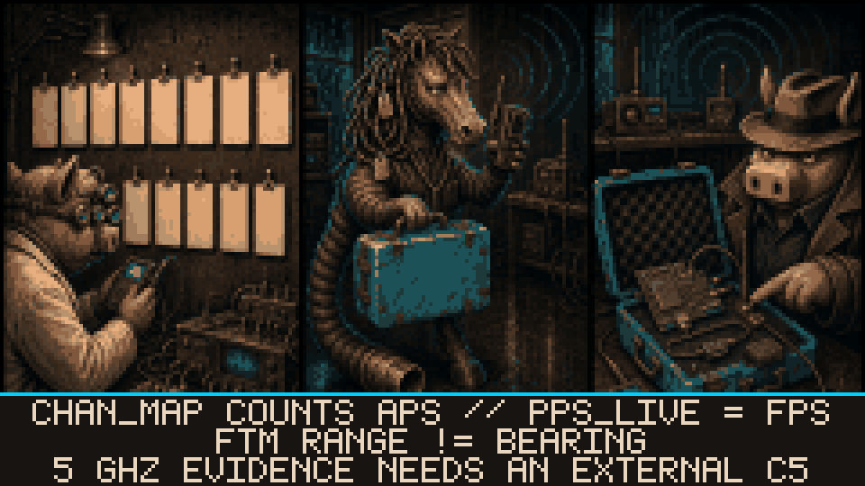

# --[ 1 - RADIO OBSERVATION: PUT THE BAND UNDER GLASS

One onboard 2.4 GHz radio listens to Wi-Fi and BLE. The firmware keeps source, age, and interpretation separate. This sounds obvious. Several thousand lines of RF code exist because obvious needed supervision.

## 2.4 GHz Wi-Fi scope

The scope listens in promiscuous mode on the current channel and walks channels 1 through 13. Completed sweeps feed a waterfall and a table of up to 48 networks. For each network it can retain BSSID, SSID, channel, RSSI, authentication mode, PMF requirement, hidden/revealed state, PHY hints, channel width, FTM responder advertisement, and observed clients.

That is frame-derived Wi-Fi evidence. It is not a calibrated laboratory spectrum analyzer with a cute face. The display labels each data path because smooth graphics do not get diplomatic immunity:

- **live/sweep data** comes from received frames and completed channel coverage;
- **MODEL** reconstructs AP-shaped lobes from known network observations;
- **5 GHz SNAP** comes from the last completed external C5 scan;
- **PPS_LIVE** is frames per second on one C5 channel, not motion or bearing;
- **CHAN_MAP** counts APs by channel. It does not measure airtime utilization.

MODEL organizes observations for the eye. It remains a model. More pixels did not change the evidence class.

## Client and direction evidence

The client monitor assigns RSSI and SNR only to frames transmitted by the selected client. Reverse-direction traffic may refresh presence, but it cannot invent a client-signal sample. AP traffic is AP traffic. The packet direction field finally gets to matter.

RAD/THRU combines fresh signal samples with device pose. A bearing lock needs four observed sectors and at least 60 degrees of rotation. The result is screen-relative direction evidence. It can tell you where to sample next. It cannot produce a map coordinate, and it cannot promise the target stayed put while the UI celebrated.

Stale samples keep their stale label. Animation is not a timestamp-renewal service.

On supported CoreS3 SE setups, an explicit FTM request can report range and variance when the AP advertises responder support. FTM transmits an active request. It estimates range when the exchange succeeds. It does not add bearing. Geometry declined the firmware update.

## Deauthentication watch

The scope watches 802.11 deauthentication and disassociation frames. The local burst detector looks for roughly five frames inside three seconds and can retain channel, RSSI history, source/target addresses, subtype counts, and burst context.

Detection proves those management frames were observed. It does not identify a person, establish intent, or produce legal attribution. A burst is an indicator. The human conclusion department remains staffed by humans.

## BLE catalog and tracking

The BLE scanner builds a PSRAM-backed catalog from advertisements and carries 18 classifier slots: `UNKNOWN` plus 17 named families. They cover common tracker, beacon, pairing, HID, spam, and ecosystem signatures. Entries can retain payload identity hashes, rotating-MAC history, RSSI, transmit-power hints, advertisement metadata, service/company identifiers, interval behavior, and freshness.

The operator can:

- follow one payload identity while its MAC rotates;
- read RSSI history and a Geiger-style proximity cadence;
- combine pose-tagged samples into a relative bearing view;
- keep up to six named identities on a watchlist;
- request GATT service, Device Information Service, and battery data;
- cycle passive scan, active scan, and active scan with chaff.

RSSI filter response, last-known ghost markers, and persistent watchlist labels live under [`TR4CK & W4TCH`](Operator-Configuration.md#tr4ck--w4tch).

Passive advertisement listening observes. Active scanning, GATT enumeration, an AirTag sound request, and chaff transmit. Use active functions only on equipment you own or are explicitly authorized to test. Curiosity is not authorization with better branding.

## Optional 5 GHz evidence

The onboard radio is 2.4 GHz only. A connected ESP32-C5 running compatible JanOS firmware can send separate 5 GHz scan rows, channel census data, packets-per-second samples, GPS fixes, and supported target observations over UART.

The source label survives the cable. A C5 scan row remains an external snapshot. Sharing a UART does not make it native ESP32-S3 spectrum data, no matter how coordinated the color palette becomes.

---

The band has entered evidence. Continue with [Capture and Defense](Capture-and-Defense.md), then audit every claim against [Evidence Truth and Safety](Evidence-Truth-and-Safety.md).
